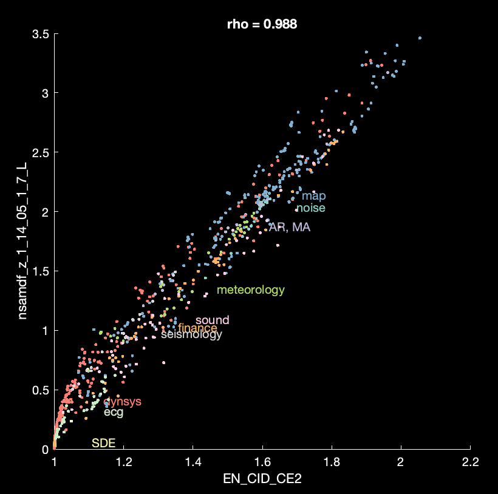

# Candidate Feature Lab

This is about testing newly proposed features for inclusion in [_hctsa_](https://github.com/benfulcher/hctsa).
Features that are sufficiently unique, when judged across a diverse range of time series are included.

### Basic Pipeline

See the [_hctsa_ gitbooks page](https://hctsa-users.gitbook.io/hctsa-manual/analyzing_visualizing/feature-comparison) for more detailed instructions.

First, download `HCTSA_Empirical1000.mat` and `INP_1000ts.mat` from [figshare](https://doi.org/10.6084/m9.figshare.5436136.v9), as an example data context for comparison.

1. Prepare input files: `INP_master_ops_new.txt`,`INP_ops_new.txt` and compute their features (using the same version of _hctsa_ as you downloaded the precomputed versions from figshare):

```matlab
TS_Init('INP_1000ts.mat','INP_master_ops_new.txt','INP_ops_new.txt',false,'HCTSA_newFeatures.mat');
TS_Compute(false,[],[],'missing','HCTSA_newFeatures.mat');
```

2. Combine with `HCTSA_Empirical1000.mat`:

```matlab
TS_Combine('HCTSA_Empirical1000.mat','HCTSA_newFeatures.mat',true,true,'HCTSA_merged.mat');
```

3. Check behavior of new feature (e.g., `myNewFeature`):

```matlab
load('HCTSA_merged.mat','Operations');
theID = Operations.ID(strcmp(Operations.Name,'myNewFeature'));
TS_SimSearch(theID,'tsOrOps','ops','numNeighbors',40,'whatData','HCTSA_merged.mat','whatPlots',{'scatter','matrix'})
```

You can also run the specific file in this repository, e.g.,:
```matlab
loadedData = load('HCTSA_merged.mat');
TS_FeatureFeatureScatter(loadedData,[871,7704]);
```



### Results

Test results for specific features are in the wiki.
